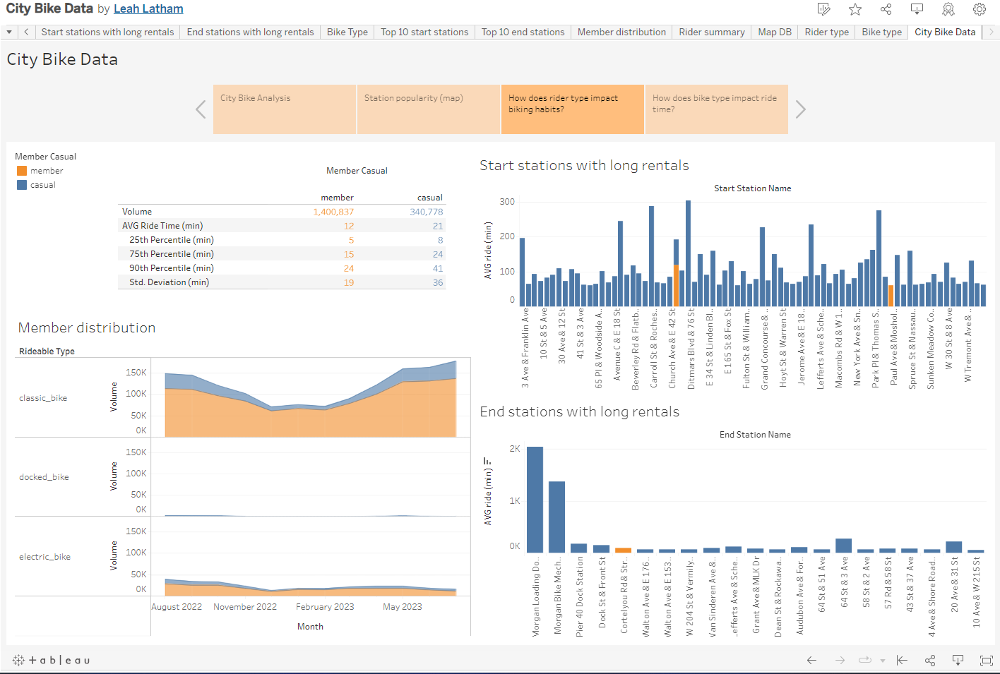

# city-bike-challenge
Module 18 Challenge

This challenge may be viewed by opening the 'City Bike Data' file attached in this repository or by clicking on the link shown below.  This analysis looks at bike station data in New York City and Jersey City from August 2022 to July 2023.

## INCLUDED IN THIS REPOSITORY:

- Resources folder containing an Images folder with screenshots from Tableau project
- City Bike Data - Tableau File containing Tableau workbook
- cleaning.ipynb - Jupyter Notebook file containing cleaning steps

___________________________________________________________________

## LINK TO TABLEAU PUBLIC

https://public.tableau.com/app/profile/leah.latham/viz/CityBikeData_16968212176360/CityBikeData

___________________________________________________________________

## VISUALIZATION DESCRIPTIONS

### 1. ANALYSIS

The analysis tab provides an overview of the other visualizations, with potential findings or considerations.

### 2. Station popularity (map)

This map shows bike station locations by popularity (size) and average ride time (color) and can be filtered by month when using the dropdown menu on the right-hand side of the map in the legend.

### 3. How does rider type impact biking habits?

This dashboard contains a table, two bar graphs, and three area graphs that explore the differences between member riders (orange) and casual riders (blue).

### 4. How does bike type impact ride time?

This dashboard contains a circle graph and two tables that show the top 10 most popular start and end locations with average ride time by month.  This can be filtered by bike type (classic, docked, and electric) by using the dropdown menu in the legend.

___________________________________________________________________

## SUMMARY

- In review of this data, member riders and casual riders show different habits.  With member rider trips averaging 9 minutes less than casual riders with a lower standard deviation and infrequent extended rental times (greater than one hour), it appears member riders take more consistent, frequent trips.  This could be explained by members regularly using this service for commutes to and from work.  In contrast, there is increased variation in casual member rides, which could be explained by infrequent leisure trips. 

- When reviewing bike types, docked bikes have the most variation and the lowest volume (0.5% of the total bikes), with 100% of the sampled docked bike rentals belonging to casual riders.  This high variation may skew the overall data.  

- It may be beneficial to separate the member rider data from the casual rider data when compiling future analyses to prevent changes in one type from inadvertently impacting the other.